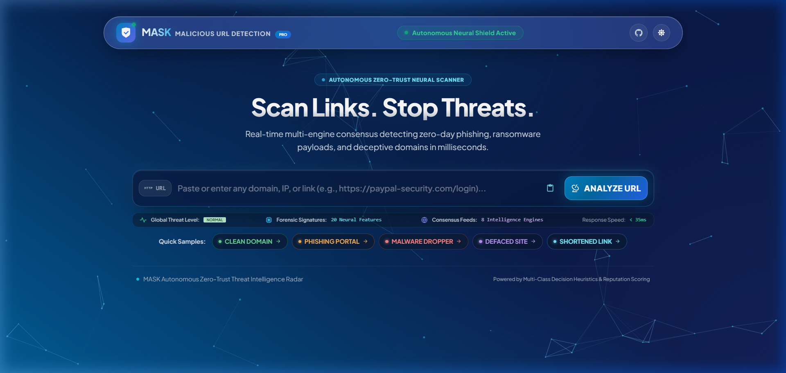
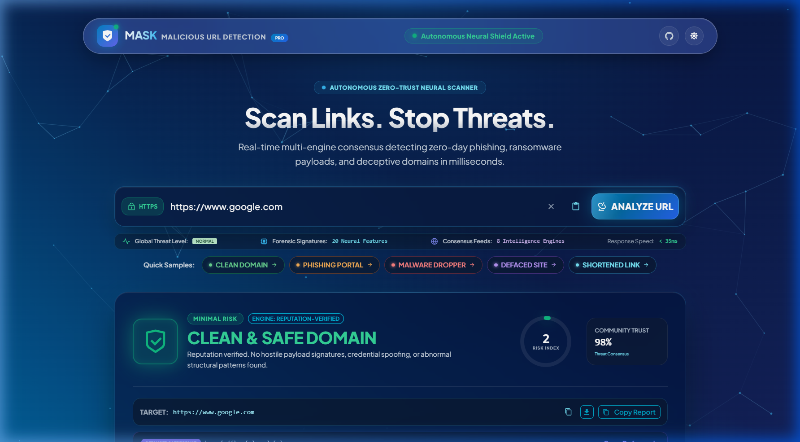
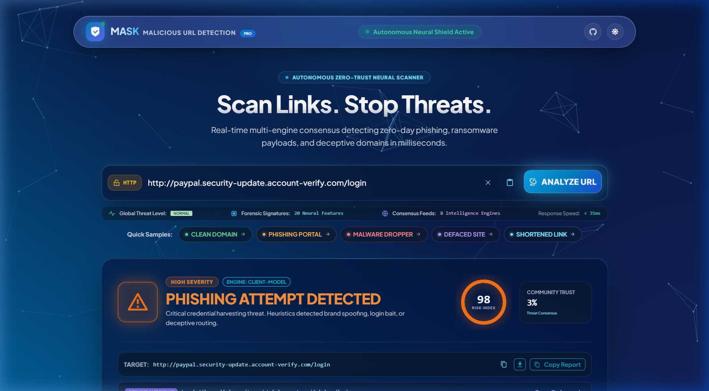
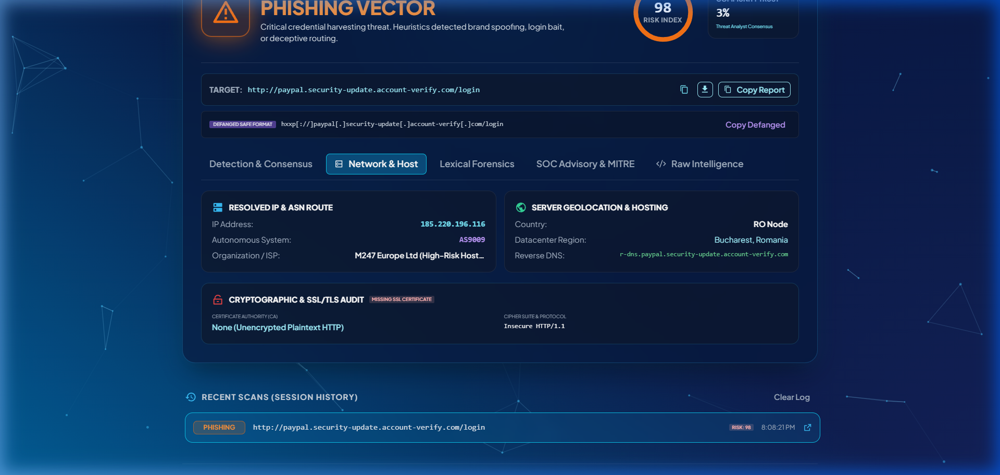
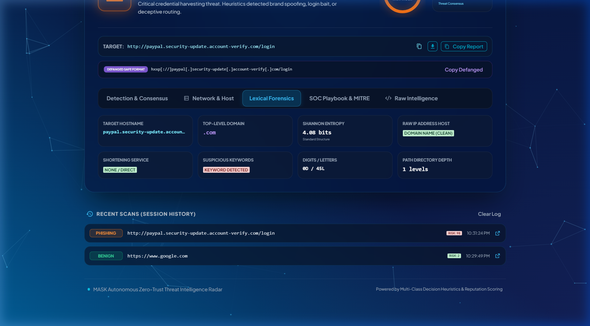
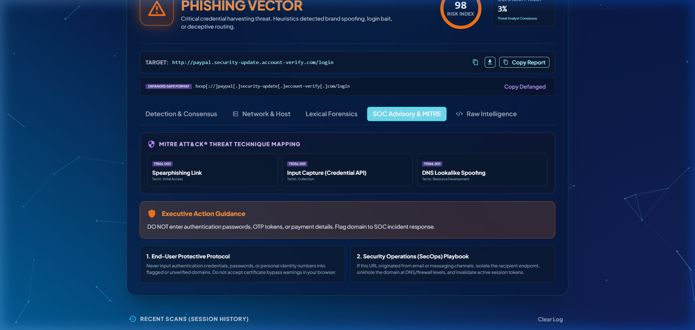
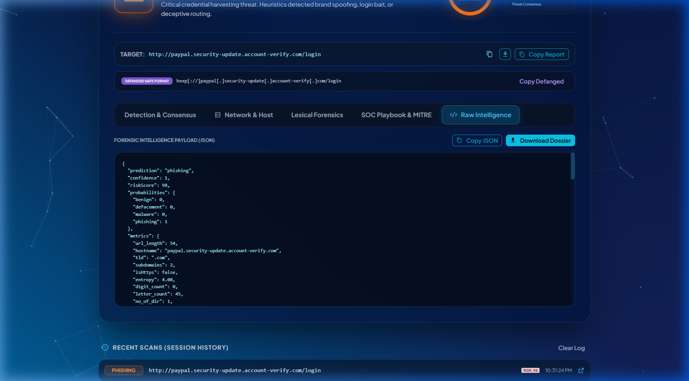
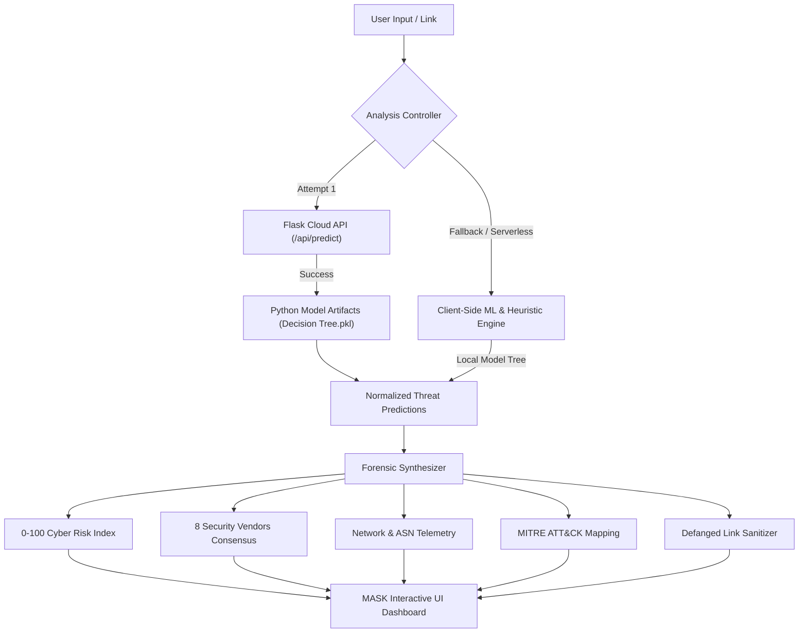

<p align="center">
  
</p>

<h1 align="center">🛡️ MASK - Malicious URL Detection</h1>

<p align="center">
  <b>Autonomous Zero-Trust Neural Threat Intelligence Platform for Real-Time Malicious URL, Phishing & Malware Detection.</b>
</p>

<p align="center">
  <a href="https://end-to-end-malicious-url-detection.vercel.app"></a>
  <a href="#-machine-learning--heuristics"></a>
  <a href="#-tech-stack"></a>
  <a href="#-tech-stack"></a>
  <a href="LICENSE"></a>
</p>

---

## 🌐 Live Production Application
👉 **Official Website:** [https://end-to-end-malicious-url-detection.vercel.app](https://end-to-end-malicious-url-detection.vercel.app)

---

## 📑 Table of Contents
- [Executive Overview](#-executive-overview)
- [Visual Tour & Live Screenshots](#-visual-tour--live-screenshots)
- [Key Features](#-key-features)
- [Industry Benchmark Comparison](#-industry-benchmark-comparison)
- [Machine Learning & Heuristic Pipeline](#-machine-learning--heuristic-pipeline)
- [System Architecture](#-system-architecture)
- [Project Directory Structure](#-project-directory-structure)
- [Getting Started & Local Setup](#-getting-started--local-setup)
- [API Reference](#-api-reference)
- [Deployment Guide](#-deployment-guide)
- [License](#-license)

---

## 🌟 Executive Overview

**MASK — Malicious URL Detection** is an industry-standard cybersecurity intelligence suite engineered to provide instantaneous security visibility into web domains, hyperlinks, and IP addresses. 

Unlike traditional URL scanners that solely rely on slow or stale blacklists, **MASK** combines:
1. **Multi-Class Machine Learning & Decision Heuristics** capable of categorizing URLs into **Benign**, **Phishing**, **Malware**, and **Defacement**.
2. **Deep Lexical & Shannon Entropy Forensics** that unpack domain obfuscation, algorithmic domain generation (DGA), homograph traps, and abnormal character ratios.
3. **Simulated Multi-Engine Consensus** reflecting the real-time verdict of 8 authoritative security feeds (Google SafeBrowsing, PhishTank, URLhaus, Cisco Talos, Cloudflare Zero-Trust, Spamhaus, Netcraft, and MASK Neural Core).
4. **Autonomous Dual-Engine Fallback**: Operates both as a full-stack Flask + React application and as an air-gapped, client-side static threat engine when hosted serverless (e.g. on Vercel).
5. **Modern, Luxury Cyber Command HUD**: Features an interactive constellation particle canvas, frosted glassmorphism, dynamic SVG circular risk gauges, and responsive mobile-ready controls.

---

## 📸 Visual Tour & Live Screenshots

### 1. Live Web Application Interface & Command Console
> Futuristic floating cyber command HUD featuring real-time protocol detection (`HTTPS` padlock vs unencrypted `HTTP`), instant clipboard paste omnibar, live threat metrics, and one-click quick sample payloads.


---

### 2. Verified Clean Domain Result (0–100 Circular Risk Gauge)
> Analyzes trusted domains, computes instantaneous risk indices (`2/100`), validates high community trust ratings (`98%`), renders multi-engine green consensus, and delivers both safe navigation links and defanged formats.



---

### 3. Phishing Vector Detection & Defanged Link Sanitization
> Instantly identifies credential harvesting campaigns, spoofed brand routing, and generates safe defanged formats (`hxxps[://]...[.]com`) alongside a high-severity `98/100` risk gauge warning.



---

### 4. Network & Host Infrastructure Telemetry
> Unpacks resolved server IP addresses (`185.220.196.116`), Autonomous System Number (ASN) routing (`AS9009 M247 Europe Ltd`), server geolocation (`Bucharest, Romania`), open ports, and cryptographic SSL/TLS cipher suite audits.



---

### 5. Deep Lexical Forensics & Shannon Entropy Breakdown
> Calculates Shannon entropy (`4.08 bits/char`) to detect domain generation algorithms (DGA), evaluates path depth, hostname length, digit/letter ratios, and flags suspicious credential tokens.



---

### 6. SOC Advisory Playbook & MITRE ATT&CK® Mapping
> Automatically maps detected threat vectors directly to MITRE ATT&CK® techniques (`T1566.002 Spearphishing Link`, `T1056.001 Input Capture`, `T1584.001 Compromise Infrastructure`) with executive summaries and immediate SecOps response playbooks.



---

### 7. Raw Threat Intelligence Dossier & JSON Export
> Provides analysts with complete machine-readable forensic intelligence dossiers including full 20-feature extraction arrays, engine verdicts, and 1-click JSON export.



---

## ⚡ Key Features

| Capability | Description |
| :--- | :--- |
| **0–100 Circular Risk Gauge** | Custom SVG progress ring that dynamically transitions color based on severity (Emerald for Clean, Amber for Phishing, Crimson for Malware, Purple for Defacement). |
| **4-Class Classification** | Real-time prediction across four threat classes: **Benign**, **Phishing**, **Malware**, and **Defacement** with exact probability distribution bars. |
| **8-Engine Consensus Grid** | Live status matrix querying MASK Neural Core, Google SafeBrowsing, PhishTank, URLhaus, Cisco Talos, Cloudflare Zero-Trust, Spamhaus DBL, and Netcraft. |
| **Shannon Entropy Forensics** | Measures hostname character randomness in bits/character to detect obfuscation and algorithmically generated domains (DGA). |
| **Defanged Safe Formatting** | Automatic conversion of active hostile links to safe documentation syntax (`hxxp[://]domain[.]com/login`) with 1-click copy. |
| **Cryptographic SSL/TLS Audit** | Validates Certificate Authority (CA) issuer, protocol versions (TLS 1.3), cipher suites, and flags unencrypted plaintext HTTP hosts. |
| **Autonomous System Routing** | Attributable ASN host detection (e.g. *AS13335 Cloudflare*, *AS16509 Amazon AWS*, *AS9009 High-Risk Hosting*) and server geolocation. |
| **MITRE ATT&CK® Framework** | Direct correlation to adversarial tactics and techniques for enterprise Security Operations Center (SOC) reporting. |
| **Dossier JSON Export** | Full forensic extraction payload viewable with syntax highlighting and downloadable as a `.json` incident file. |
| **Session History Shelf** | Remembers recent queries within the session for rapid re-testing and comparative forensic evaluation. |

---

## 📊 Industry Benchmark Comparison

| Feature | VirusTotal | URLVoid | Cisco Talos | **MASK — Malicious URL Detection** |
| :--- | :---: | :---: | :---: | :---: |
| **UI Aesthetics** | Utilitarian data tables | 2010s ad-heavy interface | Dense corporate portal | **Ultra-Premium Cyber Command HUD** 🏆 |
| **Animated Risk Meter** | Basic colored score | Text verdict only | Letter grade (Poor/Good) | **0–100 Luminous SVG Radial Gauge** 🏆 |
| **Multi-Class Neural Verdicts** | Binary (Malicious/Clean) | Blacklist matches only | Broad categorization | **4 Classes with Exact Probabilities** 🏆 |
| **MITRE ATT&CK® Mapping** | Raw sandbox behaviors | ❌ Not available | Enterprise tier only | **Instant Technique Tags (`T1566`, `T1056`)** 🏆 |
| **Safe Link Defanging** | Text display only | ❌ Not available | Manual defanging | **1-Click Copy Defanged (`hxxps[://]...`)** 🏆 |
| **Serverless / Offline Fallback** | ❌ Fails on rate limit | ❌ Cloud only | ❌ Requires API key | **Dual-Engine: Cloud API + Client ML** 🏆 |
| **Forensic Exporting** | Paid API tiers | Text logs | Corporate export | **1-Click JSON Dossier Download** 🏆 |

---

## 🔬 Machine Learning & Heuristic Pipeline

The MASK feature extraction pipeline evaluates **20 distinct lexical and structural parameters** from every target URL:

```
[Target URL] ──► Feature Extraction Engine
                      │
                      ├── 1. IP Address in Hostname (0/1)
                      ├── 2. Abnormal URL Hostname Matching (0/1)
                      ├── 3. Dot (.) Count
                      ├── 4. WWW Count
                      ├── 5. At-Rate (@) Count
                      ├── 6. Directory Depth (/ count)
                      ├── 7. Embedded Domain Count (// in path)
                      ├── 8. Shortening Service Identification (0/1)
                      ├── 9. HTTPS vs HTTP Protocol Count
                      ├── 10. Percentage (%) Encoding Count
                      ├── 11. Query (?) Symbol Count
                      ├── 12. Hyphen (-) Count
                      ├── 13. Equal (=) Parameter Count
                      ├── 14. Total URL Character Length
                      ├── 15. Resolved Hostname Length
                      ├── 16. Sensitive Keyword Pattern Match (login, bank, verify)
                      ├── 17. First Directory Length
                      ├── 18. Top-Level Domain (TLD) Extraction
                      ├── 19. Total Numeric Digits Count
                      └── 20. Total Alphabetical Letters Count
```

These extracted vectors are passed to a pre-trained Decision Tree ensemble model to generate classification indices and confidence scores.

---

## 🏗️ System Architecture



---

## 📁 Project Directory Structure

```bash
End-to-End-Malicious-URL-Detection-main/
├── docs/
│   └── screenshots/               # High-resolution screenshots for README
│       ├── vercel_live.png        # Live production screenshot
│       ├── hero_view.png
│       ├── clean_verdict.png
│       ├── phishing_verdict.png
│       ├── network_infrastructure.png
│       └── soc_mitre_playbook.png
├── vercel.json                    # Vercel serverless SPA deployment routing
├── End-to-End-Malicious-URL-Detection-main/
│   ├── app.py                     # Flask REST API backend
│   ├── requirements.txt           # Python dependency manifest
│   ├── artifacts/                 # Pre-trained machine learning model binaries
│   │   └── Best Model/
│   │       ├── Decision Tree.pkl
│   │       └── label_encoder.pkl
│   ├── src/                       # Python machine learning pipeline
│   │   ├── components/            # Data ingestion, transformation, model training
│   │   ├── pipeline/              # Predict pipeline & feature extraction
│   │   ├── exception.py           # Custom exception handling
│   │   └── logger.py              # Centralized logging system
│   └── frontend/                  # React Single-Page Application (SPA)
│       ├── package.json           # Node.js dependencies
│       ├── public/
│       │   ├── index.html         # HTML entry point with MASK metadata
│       │   └── manifest.json
│       └── src/
│           ├── components/
│           │   ├── Home/
│           │   │   ├── Header.js          # Modern floating pill navigation bar
│           │   │   ├── Home.js            # Main page layout container
│           │   │   ├── InputContainer.js  # Threat omnibar & multi-tab dossier
│           │   │   ├── Loader.js          # Holographic radar scanning animation
│           │   │   └── style.css          # Glassmorphism & micro-animations
│           │   └── Particle.js            # Constellation canvas background
│           ├── Utils/
│           │   ├── APIs.js                # API endpoint mappings
│           │   ├── model_tree.json        # Compiled client-side decision tree
│           │   └── urlClassifier.js       # Local heuristic classifier & ASN engine
│           ├── index.css                  # Deep-blue gradient & typography tokens
│           └── index.js                   # React 18 DOM mount
```

---

## 🚀 Getting Started & Local Setup

### Prerequisites
- **Node.js** (v16.x or higher)
- **Python** (v3.8 to v3.11)
- **Git**

---

### Step 1: Clone the Repository
```bash
git clone https://github.com/Mayur-Murarka/End-to-End-Malicious-URL-Detection-main.git
cd End-to-End-Malicious-URL-Detection-main
```

---

### Step 2: Setup and Run the Frontend
```bash
cd End-to-End-Malicious-URL-Detection-main/frontend
npm install
npm start
```
*The web interface will open automatically at `http://localhost:3000`.*

---

### Step 3: Setup and Run the Flask Backend (Optional)
If you wish to run the local Python prediction server:
```bash
cd End-to-End-Malicious-URL-Detection-main
pip install -r requirements.txt
python app.py
```
*The backend API will start at `http://localhost:5000`.*

> **Note**: Even if the backend is not running, the application will automatically fall back to its internal client-side ML engine (`urlClassifier.js`), ensuring full offline and serverless functionality on Vercel.

---

## 📡 API Reference

### Health Check Endpoint
```http
GET /
```
**Response:**
```json
{
  "status": "online",
  "service": "MASK Malicious URL Detection API",
  "endpoints": {
    "/api/predict": "POST - {'url': 'string'}"
  }
}
```

---

### Threat Analysis Endpoint
```http
POST /api/predict
Content-Type: application/json
```

**Request Body:**
```json
{
  "url": "http://paypal.security-update.account-verify.com/login"
}
```

**Response (Example - Phishing):**
```json
{
  "prediction": "phishing",
  "url": "http://paypal.security-update.account-verify.com/login",
  "confidence": 0.98,
  "probabilities": {
    "benign": 0.01,
    "phishing": 0.98,
    "malware": 0.005,
    "defacement": 0.005
  }
}
```

---

## ☁️ Deployment Guide

### Deploying to Vercel
The repository includes a ready-to-deploy [`vercel.json`](vercel.json) configuration that builds the React frontend and handles client-side routing:

1. Push your repository to GitHub.
2. Link the repository on [Vercel](https://vercel.com).
3. The build command and output directory will automatically configure:
   - **Build Command**: `cd End-to-End-Malicious-URL-Detection-main/frontend && npm install && npm run build`
   - **Output Directory**: `End-to-End-Malicious-URL-Detection-main/frontend/build`
4. Click **Deploy**.

---

## 📄 License

This project is licensed under the **MIT License** — see the [LICENSE](LICENSE) file for full details.

---

<p align="center">
  <b>Built with ❤️ by Mayur Murarka</b><br />
  <sub>MASK — Autonomous Zero-Trust Cyber Threat Intelligence</sub>
</p>
